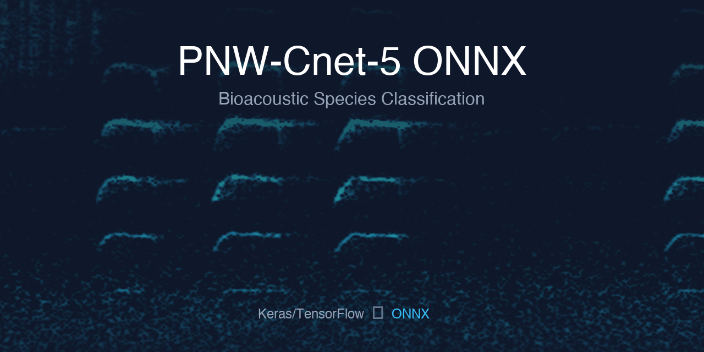

# PNW-Cnet-5 ONNX Conversion Tutorial



This repository documents converting the [PNW-Cnet-5](https://github.com/zjruff/PNW-Cnet-5) bioacoustic classifier from Keras/TensorFlow to ONNX format, achieving **11x faster inference** on Apple Silicon using CoreML acceleration vs CPU only.

This is meant to be informative and potentially help you if you are working with a similar model.

The discussion forum on this repo is open and let me know if you have any questions or suggestions!

## Results Summary

| Metric | Keras (CPU) | ONNX | ONNX-slim |
|--------|-------------|------|-----------|
| Time per image | 16.6ms | 1.4ms | 1.6ms |
| 3300 images | 55s | 4.7s | 5.3s |
| Speedup | 1x | **11.6x** | **10.2x** |
| Classification accuracy | baseline | 100% match | 100% match |

### Benchmark Environment

- **Hardware:** Apple M2 Pro (10-core CPU, 16-core GPU, 16-core Neural Engine)
- **OS:** macOS 15 (Sequoia)
- **Python:** 3.12
- **ONNX Runtime:** 1.20+ with CoreMLExecutionProvider
- **Dataset:** 3300 spectrogram images (257x1000 grayscale)

### Apple Silicon Notes

On Apple Silicon, TensorFlow's Metal GPU plugin can produce **incorrect results** for this model architecture. The comparison script automatically runs Keras in CPU-only mode. The ONNX models use CoreML which correctly leverages the Neural Engine and GPU.

## Quick Start

### Prerequisites

- Python 3.10-3.12
- [sox](http://sox.sourceforge.net/) for audio processing
- macOS with Apple Silicon (for CoreML acceleration)

```bash
# Install sox
brew install sox

# Install Python dependencies
uv sync
```

### Download Audio Data

Download `.wav` files into a `recordings/` directory. You can use recordings from the [PNW-Cnet dataset](https://zenodo.org/records/10895837) or your own field recordings.

```bash
# Download dataset part 1 (extracts .wav files to recordings/)
uv run python download_dataset.py

# List available dataset parts
uv run python download_dataset.py --list

# Download a specific part
uv run python download_dataset.py --part part2
```

### Convert Audio to Spectrograms

```bash
# Single file
uv run python wav_to_spectrogram.py recording.wav output_spectrograms/

# Entire directory
uv run python wav_to_spectrogram.py recordings/ output_spectrograms/
```

Audio files are split into 12-second clips, each producing a 257x1000 grayscale spectrogram.

### Convert Model to ONNX

```bash
uv run python convert_to_onnx.py
```

This converts `model/Final_Model.h5` to `model/Final_Model.onnx`.

#### ONNX-slim (Optional)

You can optionally optimize the ONNX model with [onnxslim](https://github.com/inisis/onnxslim) for a smaller file size:

```bash
uv run onnxslim model/Final_Model.onnx model/Final_Model_slim.onnx
```

In our benchmarks, ONNX-slim produces identical results but was slightly slower than the original ONNX model with CoreML. The file size reduction may still be useful for deployment.

### Run Inference

**With ONNX (fast):**
```bash
uv run python run_inference_onnx.py output_spectrograms/

# Export to CSV
uv run python run_inference_onnx.py output_spectrograms/ --output predictions.csv
```

**With Keras (for comparison):**
```bash
uv run python run_inference.py output_spectrograms/
```

### Compare Models

Verify the ONNX conversion produces identical results:

```bash
# Basic comparison
uv run python compare_models.py output_spectrograms/

# Compare all three models
uv run python compare_models.py output_spectrograms/ --onnx-slim-model model/Final_Model_slim.onnx
```

Output shows numerical differences, classification agreement, and performance comparison.

## Command Reference

### download_dataset.py
```bash
uv run python download_dataset.py [options]
  --list                List available dataset files
  --part PART           Which part to download: part1, part2, part3, part4 (default: part1)
  --output-dir PATH     Output directory (default: recordings)
  --keep-zip            Keep the zip file after extraction
```

### wav_to_spectrogram.py
```bash
uv run python wav_to_spectrogram.py <input> <output_dir> [--clip-duration 12]
```

### convert_to_onnx.py
```bash
uv run python convert_to_onnx.py [--input model.h5] [--output model.onnx] [--opset 13]
```

### run_inference_onnx.py
```bash
uv run python run_inference_onnx.py <input_dir> [options]
  --model PATH        ONNX model path (default: model/Final_Model.onnx)
  --threshold FLOAT   Confidence threshold (default: 0.5)
  --top-k INT         Top predictions to show (default: 5)
  --batch-size INT    Batch size (default: 32)
  --output PATH       Export results to CSV
```

### compare_models.py
```bash
uv run python compare_models.py <input_dir> [options]
  --h5-model PATH          Keras model path
  --onnx-model PATH        ONNX model path
  --onnx-slim-model PATH   ONNX-slim model path (optional)
  --threshold FLOAT        Classification threshold
```

## References

- **Dataset:** https://zenodo.org/records/10895837
- **Original Model:** https://github.com/zjruff/PNW-Cnet-5
- **BirdNET ONNX Conversion:** https://github.com/birdnet-team/BirdNET-Analyzer/issues/177

## Reference Scripts

The `reference_scripts/` directory contains the original model architecture and training scripts from [PNW-Cnet-5](https://github.com/zjruff/PNW-Cnet-5).
